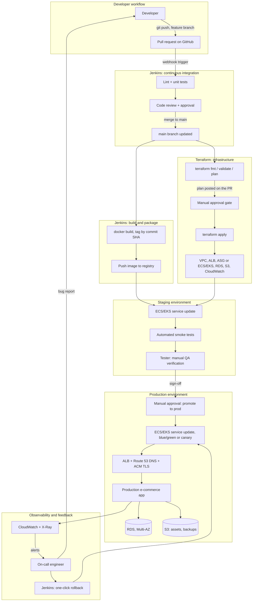

# CI/CD Pipeline & Progressive Delivery

## 21 CI and CD, End to End

The full path from commit to running service, plus the two operations jobs the customer names explicitly.

- Lint and test stages
- Container build and push to ECR tagged by commit
- `terraform fmt`, `validate` and `plan` posted onto the pull request
- The approval gate, `terraform apply`
- ECS service update with wait-for-stable, smoke tests
- A one-click rollback job, notifications
- Safe SQL execution inside a transaction, and log extraction for a time window

### The whole system, end to end

Every topic in this site is one piece of a single real pipeline — worth seeing assembled once, broad rather than deep, before going back into any one piece's own detail page.



#### Who does what, and in what order

1. **Developer** pushes a feature branch and opens a pull request on GitHub — the same scoped-credential clone pattern as [jenkins.md](jenkins.md)'s `github-pat`, just triggered by a webhook (jenkins.md's Multibranch Pipeline/webhook section) instead of a manual build.
2. **Jenkins CI** picks up the PR: lint and unit tests run first, fast feedback before anything expensive happens. A human code review gates the merge — nothing below this point starts until a reviewer approves and the branch merges to `main`.
3. Once merged, two independent Jenkins pipelines fan out from the same commit, in parallel rather than one blocking the other:
   - **Build**: [containers.md](containers.md)'s production image gets built and tagged by commit SHA, then pushed to a registry — [jenkins.md](jenkins.md)'s 20.6/20.8/20.14 sections cover exactly this step, including the credential handling and the registry-push variant.
   - **Infrastructure**: [terraform.md](terraform.md)'s `plan` runs and gets posted on the PR for review; a human approves it, then `apply` actually provisions or updates the AWS resources everything else needs — the [networking.md](networking.md) VPC, [load-balancing-dns.md](load-balancing-dns.md)'s ALB and Route 53, the compute layer from [compute.md](compute.md), and the [databases.md](databases.md) RDS instance.
4. **Staging** only starts once both of those finish: the new image is deployed onto infrastructure that's already up to date, then automated smoke tests run immediately — catching an obviously broken deploy before a human ever looks at it.
5. **Tester** does the part a smoke test can't: exploratory and scenario-based QA against the actual staging environment, signing off only once satisfied it behaves correctly, not just that it started.
6. A second, separate approval gate — deliberately distinct from the infrastructure approval in step 3 — promotes the same already-tested image to **production**, using a blue/green or canary rollout (jenkins.md's 20.14/[storage-observability.md](storage-observability.md) territory) rather than an all-at-once cutover.
7. Production traffic flows through the ALB and DNS layer into the running app, which reads from and writes to RDS and S3 the same way staging just did — same infrastructure shape, promoted environment.
8. **Observability** ([storage-observability.md](storage-observability.md)'s CloudWatch/X-Ray) watches the live app continuously, not just at deploy time. An alert reaches an on-call engineer, who either kicks off Jenkins' one-click rollback (back to the previous known-good image, no new build required) or files what they found back to the developer — closing the loop the diagram starts with.

!!! note "Why Build and Infrastructure run in parallel, not one after the other"

    Building a Docker image and provisioning/updating AWS infrastructure don't depend on each other's output — the image doesn't need to know the VPC's CIDR range, and `terraform apply` doesn't need the image to already exist. Running them in parallel Jenkins stages (or separate jobs entirely) means the total pipeline time is whichever of the two takes longer, not their sum — the same reasoning as any other independent-work parallelization, just applied at the level of two whole subsystems instead of two test suites.

!!! danger "Two approval gates exist on purpose, not by accident"

    Approving a `terraform plan` (step 3) and approving a promotion to production (step 6) are different decisions, made by different judgment calls, often by different people — infrastructure review asks "is this change to the AWS account safe," while the production-promotion gate asks "has this specific build actually been verified to work." Collapsing them into one approval means whoever clicks it is vouching for both at once, even though a change that's infrastructurally safe can still ship a broken application, and a perfectly good build can still ride on an infrastructure change nobody reviewed closely enough.

### One pipeline or two: combining Terraform, build, and deploy

The diagram above splits Build and Infrastructure into two independent pipelines that only meet at Staging. That's one legitimate way to structure this — not the only one. Nothing stops a single Jenkinsfile from running Terraform, pulling and building the app, and deploying it, all as sequential stages in one pipeline:

```groovy
pipeline {
    agent { label 'agent-one' }
    stages {
        stage('Code') {
            steps { git credentialsId: 'github-pat', url: '...', branch: 'main' }
        }
        stage('Terraform') {
            when { changeset "**/*.tf" }
            steps {
                sh 'terraform init'
                sh 'terraform plan -out=tfplan'
                sh 'terraform apply -auto-approve tfplan'
            }
        }
        stage('Build & Push') {
            steps {
                sh "docker build -t app:${env.BUILD_NUMBER} ."
                sh "docker push app:${env.BUILD_NUMBER}"
            }
        }
        stage('Deploy') {
            steps { sh "aws ecs update-service --service app --force-new-deployment" }
        }
    }
}
```

The `when { changeset "**/*.tf" }` guard on Terraform matters more here than it did on 20.14's docker-push pipeline — without it, every single app-only commit would re-run `terraform plan`/`apply`, adding real time to every deploy and touching state that had nothing to do with the change being deployed.

!!! success "Why you'd actually choose one pipeline"

    A combined pipeline is genuinely simpler for a small team where the same people own both infrastructure and application code — one place to look, one thing to maintain, and no cross-pipeline coordination problem to solve ("did the infra pipeline finish before the app pipeline tried to deploy onto it?" never comes up, because there's only one pipeline).

!!! danger "What actually breaks in a combined pipeline at real scale"

    - **State lock contention** — Terraform locks its state file during `plan`/`apply`. Even with the `changeset` guard above, an app-only deploy can sit blocked waiting on a lock held by an unrelated infra-only change, since the lock is per-workspace, not per-stage.
    - **Blast radius** — a broken `.tf` file, an unexpectedly destructive `plan`, or a stuck `apply` now blocks an app deploy that has nothing to do with infrastructure at all.
    - **Review granularity** — a pull request touching both app code and infrastructure gets one combined approval, making it harder to give the infrastructure change the "is this safe for the AWS account" scrutiny it deserves separately from "does this build actually work" — the exact distinction the two-approval-gates box above is making, just harder to preserve once both concerns share one pipeline.

!!! note "Start combined; split once it actually hurts"

    The split model (the diagram above) is the one to reach for once one of the failure modes above actually happens, not preemptively — the same "don't split until it hurts" judgment as any other premature abstraction. A small project or a single-team setup is usually better off with one pipeline and the `changeset` guard than with two pipelines and the coordination overhead of keeping them in sync.

## 22 Progressive Delivery, Runbook, Readiness Review

Morning: finishing the pipeline. Afternoon: the readiness review itself.

- Blue/green and canary driven from the pipeline
- Migration step ordering around a deploy
- OIDC and IAM roles instead of static credentials
- Timeouts, retries and idempotency
- The operations runbook, written from what's been built
- Readiness review: live demo, architecture defence, customer-style questioning

### Blue/green and canary, driven from the pipeline

[principles.md](principles.md)'s 2.1.3/2.1.4 already cover why you'd pick blue/green over canary — the tradeoff between instant full-blast-radius rollback and slow, metrics-gated ramping. What changes here is *who* actually flips the switch: not a person in the AWS console, but a Jenkins pipeline stage, gated the same way any other stage in this project's pipelines already is (jenkins.md's approval-gate pattern, 20.5).

#### Blue/green: ECS + CodeDeploy, one atomic swap

For an ECS Fargate service (containers.md 11/12) with a `CODE_DEPLOY` deployment controller instead of the default rolling one, Jenkins doesn't touch target groups directly at all — it hands the swap to CodeDeploy and waits:

```groovy
stage('Blue/green deploy') {
    steps {
        script {
            def deploymentId = sh(
                script: """
                    aws deploy create-deployment \\
                        --application-name investor-pro-app \\
                        --deployment-group-name investor-pro-dg \\
                        --revision '{"revisionType":"AppSpecContent","appSpecContent":{"content":"${appSpecJson}"}}'
                """,
                returnStdout: true
            ).trim()
            sh "aws deploy wait deployment-successful --deployment-id ${deploymentId}"
        }
    }
}
```

`aws deploy wait` blocks the pipeline until CodeDeploy finishes — the actual traffic switch (all-at-once, 100% blue → 100% green, principles.md 2.1.3's mechanism) happens entirely inside CodeDeploy, across two ALB target groups it manages itself, with optional `BeforeAllowTraffic`/`AfterAllowTraffic` Lambda hooks that can fail the deployment before any real user traffic reaches green at all.

!!! danger "The rollback trigger has to be a CloudWatch alarm, not a Jenkins step"

    CodeDeploy's own automatic rollback only reacts to a CloudWatch alarm entering ALARM state during the deployment — the deployment group needs `autoRollbackConfiguration` wired to one or more real alarm ARNs. A Jenkins stage that merely waits for the deployment to finish has no way to intervene mid-swap; by the time `aws deploy wait` returns a failure, an automatic rollback (if one was actually configured) has usually already happened on its own, not because of anything the pipeline did. Skipping the alarm wiring looks fine right up until a bad deploy sits live for however long it takes a human to notice, because nothing was actually watching.

#### Canary: weighted ALB target groups, moved a step at a time

For a service still on plain ALB target groups rather than CodeDeploy — load-balancing-dns.md's weighted target groups — canary is just repeated calls to `aws elbv2 modify-listener`, spaced out with a metrics check in between:

```groovy
stage('Canary rollout') {
    steps {
        script {
            def weights = [5, 25, 100]
            for (weight in weights) {
                sh """
                    aws elbv2 modify-listener --listener-arn ${LISTENER_ARN} \\
                        --default-actions '[{"Type":"forward","ForwardConfig":{"TargetGroups":[
                            {"TargetGroupArn":"${TG_V1}","Weight":${100 - weight}},
                            {"TargetGroupArn":"${TG_V2}","Weight":${weight}}
                        ]}}]'
                """
                sleep(time: 15, unit: 'MINUTES')
                def healthy = sh(script: "python3 check_canary_metrics.py --weight ${weight}", returnStatus: true) == 0
                if (!healthy) {
                    error("Canary failed its metrics check at ${weight}% -- rolling back to 100% v1")
                }
            }
        }
    }
}
```

`check_canary_metrics.py` stands in for principles.md 2.1.4's real gate — comparing v2's error rate and p99 latency against v1's baseline over the same window, not just confirming the service is alive (that's what a plain rolling deploy's health check already does).

!!! note "A hand-rolled loop isn't the only way to run a canary"

    The Groovy loop above is what you write when there's no CodeDeploy in the picture — plain ALB target groups, weights shifted by hand. If the service already uses CodeDeploy for blue/green, canary doesn't need a hand-written loop at all: CodeDeploy has its own predefined canary/linear traffic-shifting configs (`CodeDeployDefault.ECSCanary10Percent5Minutes`, `CodeDeployDefault.ECSLinear10PercentEvery1Minute`, and others), set directly on the deployment group. Picked that way, canary collapses to the exact same one-call-and-wait shape as the blue/green stage above — `aws deploy create-deployment` plus `aws deploy wait` — and CodeDeploy handles the ramp, the pauses, and CloudWatch-alarm-triggered rollback internally. The Groovy loop is the "doing it by hand" version; a CodeDeploy canary config is the "let the platform do it" version of the same idea.

!!! note "The pipeline's job is to pause and ask, not to babysit continuously"

    The `sleep` between weight increases is doing real work — it's principles.md's "watch for 30 min" step, made explicit instead of implicit. A pipeline that ramps `5 → 25 → 100` with no pause between steps isn't running a canary at all, just a fast rolling deploy with extra API calls. The deliberate pause, and a real decision made from metrics gathered during it, is what actually makes it a canary rather than rolling with more steps.

!!! success "Both patterns share the same shape as this project's other approval gates"

    Neither blue/green nor canary is really a special case — both are just another instance of the same wait/check/proceed-or-fail pattern behind every other gated stage in this chapter (the two separate approval gates in the end-to-end diagram above), except the gate here is an automated CloudWatch alarm or metrics script instead of a human clicking "approve." Once a pipeline already knows how to pause on one kind of gate, adding another kind is a small extension, not a new capability.

#### Who actually stops and starts a task during any of this

Three different layers are involved, and it's worth being precise about which one does what — "the deploy" isn't one single actor.

Terraform
:   Declares the *shape* — that an ECS service should exist, its task definition family, desired count, deployment controller type. It runs once, deliberately, when that shape itself changes, and it is not invoked as part of a routine deploy at all. It never starts or stops an individual task.

Jenkins / CodeDeploy
:   Triggers the deploy with a single API call — `aws ecs update-service --task-definition ...` or `aws deploy create-deployment` — then waits for a result. Neither one issues a "stop this task, start that one" command; that sequencing is delegated entirely to the next layer.

ECS's own service scheduler
:   A long-running AWS control-plane process, not anything in the pipeline, that actually carries out the lifecycle: launches new tasks from the new task definition, waits for them to pass their health check, registers them into a target group, and only *then* starts draining and stopping the old tasks so in-flight requests finish first. This is identical machinery whether the deploy is a plain rolling update or a blue/green one — nobody hand-writes this sequencing anywhere in a Jenkinsfile.

!!! danger "Canary specifically: the ramp itself stops nothing"

    Shifting an ALB or CodeDeploy traffic weight from 5% to 25% is a pure routing change — during the entire ramp, **both the old and new task sets stay fully running at the same time**, which is precisely what makes it a canary instead of a replace-in-place rolling deploy. Nothing gets stopped until the ramp reaches 100% and a configured termination-wait time elapses — only then does CodeDeploy (or whatever drives the rollout) finally deregister and stop the old tasks. Expecting to see old tasks disappear as the percentage climbs is the wrong mental model; they disappear once, at the very end, not gradually.

!!! note "Known thinness"

    Three days is enough to build and operate this pipeline, not to design a delivery platform from nothing. Jenkins is targeted at L2 on 30 September and finishes during October's knowledge transfer, on the customer's own Jenkins, with the tech lead pairing.


