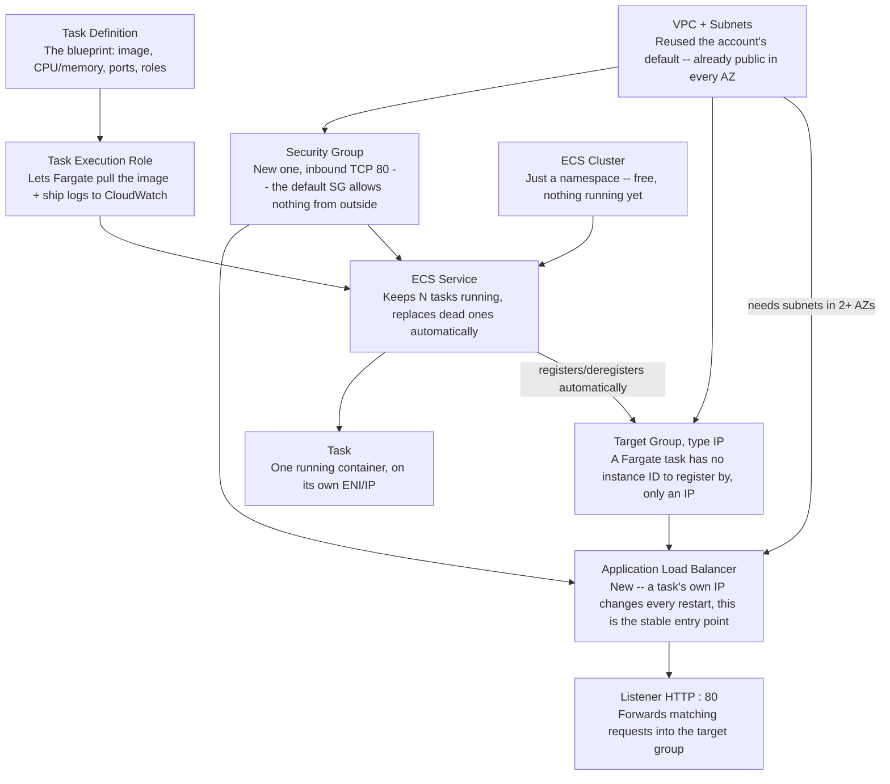
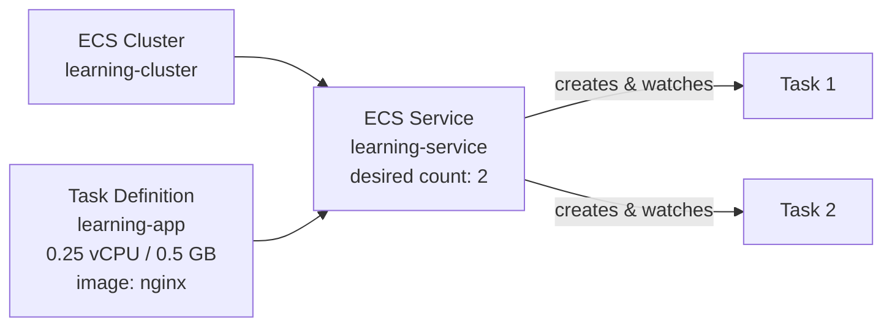
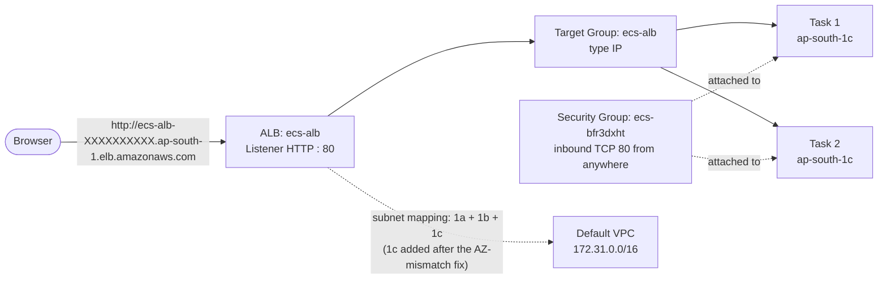
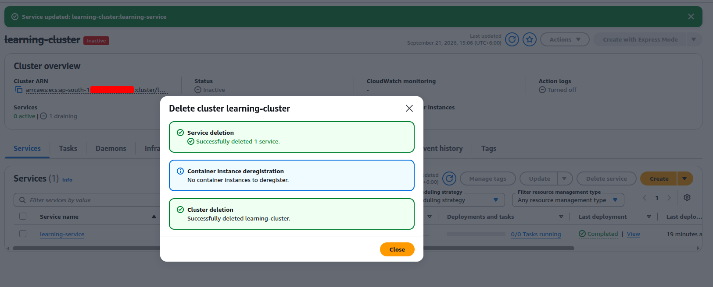

# Containers: ECS Fargate & EKS

## 10 Production Container Images

Building an image that's actually fit to run in production, not just to work on a laptop.

- A Dockerfile that's small and cacheable
- Multi-stage builds
- Non-root users
- Health endpoints
- Configuration through the environment, not baked into the image
- Tagging by commit
- ECR and image scanning
- A local multi-container stack to develop against

## 11 ECS Fargate

The serverless container runtime the customer's platform already runs on.

Amazon ECS (Elastic Container Service) is AWS's own container orchestrator — it schedules Docker containers onto compute, keeps a declared number of them running, replaces one that crashes, and wires them up to a load balancer, without needing a self-managed Kubernetes control plane (that's EKS's job, 13/14). Two launch types decide what actually runs the containers: **EC2** (your own Auto Scaling Group of instances — you size, patch, and pay for the underlying servers yourself) and **Fargate** (serverless — AWS runs the containers on its own infrastructure; you declare CPU and memory per task and there's no EC2 instance to manage at all). This project uses Fargate, which is why an entire category of host-level maintenance — AMI patching, instance right-sizing — never comes up here the way it does for the EC2-based compute in compute.md.

#### Specialty: what actually makes ECS different

ECS's core distinction from EKS is that there's no Kubernetes API involved at all — no `kubectl`, no YAML manifests, no separate cluster-autoscaler/ingress-controller ecosystem to install and keep patched. It's AWS's own proprietary scheduler, so it only ever runs on AWS, but in exchange it gets first-class, no-extra-setup integration with the rest of AWS: an IAM role attached directly to a task (the task role, in the bullet list below), an ALB target group registered automatically as tasks start and stop, logs shipped straight to CloudWatch, secrets pulled from Secrets Manager/Parameter Store at container start — all of it built in, none of it a separate Helm chart or operator to install and maintain.

!!! note "The tradeoff for that simplicity"

    Kubernetes' whole ecosystem — Helm charts, operators, a huge base of transferable knowledge and tooling — doesn't carry over to ECS at all, and neither does the workload itself: an ECS task definition doesn't run on GKE, AKS, or on-prem the way a Kubernetes manifest does. ECS is the simpler, faster-to-learn option specifically *because* it gives up that portability.

#### When to actually reach for it

| Situation | Better fit |
|---|---|
| Already fully committed to AWS, want to run containers without learning or operating a Kubernetes control plane | **ECS** — simplest path, least new machinery |
| Need portability across clouds, or already have Kubernetes expertise/tooling (Helm, existing operators) elsewhere | **EKS** (13/14) — same containers, a control plane that runs anywhere Kubernetes does |
| Short, bursty, event-driven work — a few seconds to a few minutes, no long-running process | **Lambda** — no cluster, no service to keep alive, billed per invocation |
| A handful of long-running services, steady load, no need for auto scaling or rolling deploys at all | Plain EC2, no orchestrator — fewer moving parts, but every restart/replace/rollout is manual |

#### Cost, compared

The orchestrator itself is not where ECS and EKS actually differ in price — the compute underneath (EC2 or Fargate) costs the same either way. The difference is the control plane:

| | Control plane cost | Compute cost |
|---|---|---|
| ECS | Free — no charge for the ECS scheduler itself | EC2 launch type (pay for the instances) or Fargate (pay per vCPU/memory-second) |
| EKS | About $0.10/hour per cluster (roughly $73/month), flat, regardless of how small the workload is | Identical EC2 or Fargate pricing underneath |
| Self-managed Kubernetes on plain EC2 | Free (no control-plane fee) | Same EC2 pricing, plus the engineering time to run and patch the control plane yourself |
| Lambda | None — no cluster at all | Per-invocation and per-millisecond; cheapest for infrequent or spiky work, most expensive per unit of *sustained* compute |

!!! danger "Fargate vs. the EC2 launch type isn't a flat 'Fargate always costs more' rule"

    Fargate charges a real premium per vCPU/memory-second over on-demand EC2 pricing for equivalent capacity — but that premium buys zero idle capacity, since Fargate only ever runs exactly what's requested, nothing more. A handful of small, spiky tasks that would otherwise sit on a mostly-idle EC2 instance are often cheaper on Fargate precisely because nothing is paid for while idle. Many tasks bin-packed tightly onto a small number of large, highly-utilized EC2 instances (or EC2/Fargate Spot capacity for either launch type) usually wins the other way. The right call depends on utilization, not on Fargate or EC2 being universally cheaper.

!!! success "What to actually know before touching any of the bullets below"

    A **cluster** is just a logical grouping — free, and mostly a namespace, not a piece of infrastructure by itself. A **task definition** is the blueprint (image, CPU/memory, ports, environment, IAM roles) — the ECS equivalent of a Docker Compose file. A **task** is one running instance of that blueprint. A **service** is what actually keeps a declared number of tasks running continuously, replacing one that dies and driving a rolling deployment — a cluster with no service running in it does nothing at all, it's just an empty namespace waiting for one.

- Clusters, task definitions and revisions, services
- Task role vs execution role
- CPU and memory sizing
- `awsvpc` networking and ENI limits
- ALB integration and service discovery
- Service auto scaling
- Rolling deployments and the deployment circuit breaker

#### Hands-on: your first ECS service, from the console

Every concept above is worth seeing click by click before it's ever expressed as Terraform — the same "build it by hand first" order the AWS weeks already follow. Nothing in this walkthrough costs more than a few cents, even left running for an hour, since Fargate bills per second and there's no idle EC2 instance sitting underneath to forget about.

##### Why each piece exists, before any clicking

Each component below solves exactly one problem the one before it doesn't — worth seeing as a dependency chain before it turns into eight separate steps.

*A security group rule is meaningless without a VPC for it to live in; a listener is meaningless without a target group to forward into. Each layer only becomes useful once the one before it already exists.*

VPC + Subnets — **why the account's default, not a new one**
:   The default VPC already has a public subnet in every Availability Zone, each with a route to an Internet Gateway — exactly what an ALB and an internet-reachable task both need. Building a VPC by hand is [networking.md](networking.md)'s own dedicated exercise; reusing what's already there keeps this lab focused on ECS and ALB mechanics instead of re-deriving CIDR planning and route tables from scratch.

Security Group — **why a new one, not the account's `default`**
:   AWS's own default security group only allows traffic between resources that already share it — nothing inbound from the internet. Nothing here could ever be reached from a browser without a security group carrying an explicit inbound rule (TCP 80, from anywhere), so a new one was created specifically for this.

Target Group — **why type IP, not Instances**
:   "Instances" registers by EC2 instance ID — something a Fargate task simply doesn't have. `awsvpc` networking mode gives every task its own network interface and IP address instead, so "IP addresses" is the only target type that can represent a Fargate task at all; it isn't a preference, it's the only option that works.

Application Load Balancer — **why a brand-new one, and why it needed two Availability Zones**
:   Before this, the only way to reach a task was its own public IP — one that changes on every restart or replacement. An ALB exists specifically to give one stable DNS name that always forwards to whichever tasks are currently healthy, no matter how many times the tasks underneath it have changed. An ALB requires subnets in **at least two** Availability Zones by design, for its own cross-AZ resilience — which is exactly what produced step 5's "Unused" target status earlier: the service placed tasks in a third AZ the ALB hadn't been given a subnet for yet, and adding that AZ's subnet to the ALB was the actual fix.

##### What we actually built

Split into two smaller diagrams on purpose — the ECS control-plane side, and the networking side it all sits inside — rather than one dense diagram trying to show both at once.

**The ECS side — cluster, task definition, service, tasks**

*A cluster and a task definition are independent of each other — neither needs the other to exist. A service is what actually ties them together, then keeps exactly two tasks alive from that point on.*

**The networking side — VPC, ALB, target group, security group**

*Everything here lives in the account's default VPC — no new VPC was built for this lab. The one real bug this diagram hints at: the ALB's subnet mapping originally covered only two of the three AZs, while the service happened to place both tasks in the third — step 5's "Unused" target status, fixed by adding that AZ's subnet to the ALB.*

##### 1. Create a cluster

**ECS console → Clusters → Create cluster**

- Name it `learning-cluster`.
- Under **Infrastructure**, the console now offers three options — **Fargate only**,  
**Fargate and Managed Instances** (AWS still provisions and patches the underlying EC2 instances for you, with more control over instance type than pure Fargate), and **Fargate and Self-managed instances** (this is the traditional EC2 launch type from the bullet list above — you own patching, sizing and scaling yourself, via your own Auto Scaling Group). Pick **Fargate only**.
- Create it. This takes seconds — a cluster really is just a logical namespace, nothing running yet, nothing billed yet.

!!! danger ""Unable to assume the service linked role. Please verify that the ECS service linked role exists.""

    A real, first-time-only failure: AWS is supposed to auto-create the `AWSServiceRoleForECS` service-linked role behind the scenes the moment any ECS resource is created in an account, and that auto-creation can lag right when `Create cluster` runs, failing this one attempt. Check **IAM console → Roles** for `AWSServiceRoleForECS` first — it's very often already there despite the error, created as a side effect of the same failed attempt. If so, just wait 60–120 seconds (IAM's own eventual-consistency delay across regions) and retry **Create cluster** — nothing else needs to change. Only if the role genuinely doesn't exist yet, create it explicitly from CloudShell or a local terminal: `aws iam create-service-linked-role --aws-service-name ecs.amazonaws.com`. The IAM console's own guided **Create role → AWS service → Elastic Container Service** flow is a trap here — on the current console that flow creates a regular, custom-named role from an old managed-policy template (`AmazonEC2ContainerServiceRole`), not the actual service-linked role this error is asking for, and won't fix anything.

##### 2. Create a task definition

**Task definitions → Create new task definition**

- Family name `learning-app`, launch type **Fargate**, task size the smallest available — **0.25 vCPU / 0.5 GB**.
- Let the console auto-create the task execution role (`ecsTaskExecutionRole`) — this is the execution role from the bullet list above, the one that lets Fargate pull the image and write logs, separate from whatever permissions the *application itself* needs (the task role).
- Container details: name `app`, image `public.ecr.aws/nginx/nginx:latest` (a public image — no registry login needed for this first pass), port mapping `80/TCP`, logging left on its default (wires up CloudWatch Logs automatically).

##### 3. Run one standalone task — see it work before anything else

**Clusters → learning-cluster → Tasks tab → Run new task**

- Launch type Fargate, task definition `learning-app`.
- Networking: a **public subnet**, and **Public IP** turned on.
- Security group: **create a new one** here rather than reusing the account's **default** security group — the default one only allows traffic between resources that already share it, nothing inbound from the internet. Choose "Create a new security group," add an inbound rule (Type: Custom TCP, Port: `80`, Source: Anywhere / `0.0.0.0/0`), and reuse this same security group for the service and load balancer in the steps below.
- Run it, and watch the task move `PROVISIONING → PENDING → RUNNING`.
- Once running, find its public IP under the task's Networking tab and open `http://<that-ip>` in a browser — the nginx welcome page confirms the whole round trip: click Run, a task launches, you can reach it.
- Stop the task once you've seen it (Tasks tab → select → Stop) — a standalone task, unlike a service, is never replaced if it dies or is stopped.

##### 4. Turn it into a service — this is what actually keeps it running

**Services tab → Create**

- Same task definition — leave the **revision** field blank or on "latest" rather than typing a number in. Only revision `1` exists at this point; revision `2` doesn't show up until step 6 deliberately creates it, so entering `2` here now fails with a "task definition not found"-style error.
- Service name `learning-service`, desired tasks `2` (so step 6's rolling deploy has something to actually roll).
- Same public subnet/security group (the one created in step 3)/public-IP settings as step 3. Skip the load balancer for now.
- Once both tasks are running, manually stop one from the Tasks tab and watch the service launch a replacement automatically within moments — the clearest possible demonstration of what a service actually adds over a standalone task.

!!! success "Pausing here without losing anything, or paying for anything, while paused"

    Fargate only bills per second while a task is actually `RUNNING` — the cluster, the task definition, and the service's own configuration cost nothing at all while idle. To stop paying without tearing anything down: **learning-service → Update service** → set **Desired tasks** to `0` → Update. Both running tasks stop, cost drops to zero, and everything else (service name, task definition link, networking, security group) stays exactly as configured. Coming back later just means the same screen, **Desired tasks** back to `2`, and picking up at whichever step was next.

##### 5. Put it behind an Application Load Balancer

Two task public IPs that change on every restart isn't how anyone actually reaches an ECS app — one stable DNS name that always points at whichever tasks are currently healthy is what an ALB actually buys here. The full console walkthrough for this lives in [load-balancing-dns.md](load-balancing-dns.md)'s "ALB + target group for an ECS Fargate service, from the console" — right before that page's own CLI-based ALB lab, since this is fundamentally the same load-balancing topic, just with a target group of **type IP** instead of instances, and automatic registration instead of a manual `register-targets` call. Use `learning-tg` / `learning-alb` as the names, the security group from step 3 above, and `learning-service` / container `app` : port `80` as the service to attach it to — then come back here for step 6 once both tasks show healthy in the target group.

##### 6. Deploy a new revision — watch a rolling update happen

- **Task definitions → learning-app → Create new revision** — change something small (swap the image tag, or add an environment variable).
- **Services → learning-service → Update service** — select the new revision.
- Watch the Deployments tab: new tasks start on the new revision, wait to pass the health check, and *only then* are the old tasks stopped — the same launch-healthy-then-drain sequence covered in jenkins.md's multi-agent deployment section, seen here directly instead of described.

##### 7. Break it on purpose

Section 14's troubleshooting list is worth reproducing deliberately, one failure at a time, so each error message is already familiar before it shows up for real:

- Point a new revision at an image that doesn't exist (`nginx:this-tag-is-fake`) → update the service → tasks stuck in a pull-and-restart loop.
- Move the service to a **private** subnet with no NAT gateway → tasks can't reach the registry at all → same restart-loop symptom, a completely different cause.
- Remove the security group's inbound rule on port 80 → the task itself runs fine, but the health check fails anyway → target group shows "unhealthy," the ALB starts returning 503.

{ target="_blank" rel="noopener" }

*The first bullet above, actually happening: `learning-app:3` can't pull its (deliberately broken) image and keeps retrying, while "Old task drain progress" stays at 0 stopped — the two `learning-app:2` tasks are untouched and still showing 2 Healthy in the target group. Zero downtime, precisely because ECS never drains an old task until a new one has actually replaced it.*

!!! success "The circuit breaker is what ends this, one way or another"

    Left alone, this deployment doesn't hang forever — the deployment circuit breaker (visible above, "Monitoring") eventually detects the repeated failure and fails the deployment automatically, rolling the service back to the last working revision without anyone clicking anything. The **Roll back** button in the same panel does the identical thing immediately, on demand, instead of waiting — the manual equivalent of what the circuit breaker does on its own.

##### 8. Clean up

Order matters for the load balancer pieces, since they live in EC2, not ECS, and nothing below touches them automatically:

- **Delete the ALB and its target group first** (EC2 console → Load Balancers, then Target Groups) — entirely separate resources from anything ECS's own cluster deletion handles next.
- **Clusters → learning-cluster → Delete cluster.** The console's delete flow cascades through everything ECS-owned in one confirmation — no need to separately set desired count to 0 or delete the service first. It runs service deletion, container instance deregistration (a no-op under Fargate, since there are no EC2 instances to deregister), and cluster deletion as three tracked steps in one dialog.
- Task definition revisions cost nothing to leave behind — this step is pure tidiness, not a cost saver. Deleting one is a two-step process, since a revision can't be deleted while it's **Active**:

    1. **Task definitions → learning-app**, select the revision(s) via checkbox, **Actions → Deregister**. This flips it to **Inactive** and hides it from the default (Active-only) filtered view — which is usually why it looks like there's nothing to act on.
    2. Switch the status filter to show **Inactive** revisions, select it again, **Actions → Delete** — the actual permanent delete, only available once a revision is Inactive.
    3. To remove every revision under the family at once instead of one at a time, **Delete task definition family** is available at the family level (`learning-app` itself) — deregisters and deletes everything under it in a single action.

{ target="_blank" rel="noopener" }

*One "Delete cluster" click, three cascaded steps confirmed — service deletion, container instance deregistration (nothing to do on Fargate), and the cluster itself, gone in a single dialog.*

!!! success "What this earns before ever touching Terraform"

    terraform.md's own reusable ECS service module (18.10-adjacent territory) stops being an abstract block of HCL once every field in it — cluster, task definition, service, target group — has already been clicked through by hand and watched actually do something. The CLI and Terraform versions of this exact walkthrough are the natural next steps once the console version feels familiar.

#### This same lab, as Terraform

[`IaC/ecs-cluster-service/`](https://github.com/Fahad-Md-Kamal/DevOps-Roadmap/tree/main/IaC/ecs-cluster-service) and [`IaC/ecs-alb/`](https://github.com/Fahad-Md-Kamal/DevOps-Roadmap/tree/main/IaC/ecs-alb) are the exact walkthrough above, written as two separate Terraform states rather than clicked through by hand — split the same way the two diagrams above are split, so neither folder needs the other's IAM permissions (the same reasoning as jenkins.md 20.16's multi-agent pipeline split, just applied to Terraform state boundaries instead of Jenkins agents).

- **`ecs-cluster-service`** — cluster, security group, task execution role, CloudWatch log group, task definition, and service.
- **`ecs-alb`** — target group (type IP), ALB, and listener.

Apply order, and it matters: `ecs-cluster-service` first with its `target_group_arn` variable left at the default `null` (the service comes up with no load balancer, exactly step 4 before step 5 exists) → feed its `security_group_id` output into `ecs-alb` and apply that → feed `ecs-alb`'s `target_group_arn` output back into `ecs-cluster-service` and apply once more, which activates a `dynamic "load_balancer"` block and attaches the ALB — the Terraform equivalent of step 5 Part C's "Update service" click. The full reasoning lives in each folder's own `main.tf` comments, not repeated here.

!!! success "New revisions and teardown are both one-line answers"

    A new task definition revision is just changing `container_image` (or `cpu`/`memory`/`container_port`) in `ecs-cluster-service` and running `terraform apply` again — no console click needed for step 6 at all. Deleting everything is `terraform destroy` in `ecs-cluster-service` first, then in `ecs-alb` — the reverse of step 8's console order, since here two separate Terraform states are doing the ordering instead of one cascaded "Delete cluster" button that already knows about both.

## 12 ECS With Real Deployment Strategies

Three services routed by path, sharing a database — Week 1's deployment-strategy decision matrix applied for real.

- Blue/green deployment with CodeDeploy
- A canary release
- A schema change deployed backward-compatibly
- Deploy under load and prove zero dropped requests

#### Hands-on: blue/green with CodeDeploy

Built fresh, deliberately separate from section 11's `learning-*` resources and from the `ecs-cluster-service`/`ecs-alb` Terraform folders, for two reasons: `learning-cluster` was already torn down in section 11's own step 8, and CodeDeploy blue/green needs the ECS service's deployment controller set to `CODE_DEPLOY` **at creation time** — immutable afterward, and not something the existing Terraform sets up. This gets its own Terraform once the console mechanics below are confirmed working, the same order section 11 followed.

##### 1. Create a cluster

Identical to section 11 step 1 — **ECS console → Clusters → Create cluster**, name it `bluegreen-cluster`, Infrastructure → **Fargate only**.

##### 2. Two target groups, not one

The first genuinely new piece. **EC2 console → Target Groups → Create target group**, twice:

- `bluegreen-tg-blue` — type **IP addresses**, protocol HTTP, port `80`, health check path `/`.
- `bluegreen-tg-green` — identical settings, just the other name.

Both stay empty on creation (skip "Register targets," same as section 11 — something else registers targets automatically). `bluegreen-tg-blue` is the one live in production initially; `bluegreen-tg-green` is where CodeDeploy stands up the new version before swapping traffic to it.

## 13 EKS Fundamentals

The Kubernetes side of the ECS-vs-EKS conversation the customer keeps having.

- Control plane vs data plane
- Managed node groups vs Fargate profiles
- `kubectl` and contexts
- Pods, deployments, services, ingress
- ConfigMaps and secrets
- Requests and limits
- IRSA for pod-level IAM
- The horizontal pod autoscaler and the AWS Load Balancer Controller

## 14 ECS vs EKS, Decided

Deploy the same service to EKS behind an ALB ingress and perform a rolling update, then a troubleshooting clinic across both runtimes.

- Image pull failure
- Wrong subnet
- Missing permission
- Failing probe
- Out-of-memory kill
- Write the ECS-vs-EKS comparison

!!! note "Designated give"

    This Friday is the only flexible day in the month. If a public holiday or absence costs a day anywhere in September, it's taken from here — EKS drops to a single day and the comparison becomes a written exercise instead. AWS, Terraform and Jenkins weeks are never compressed.

