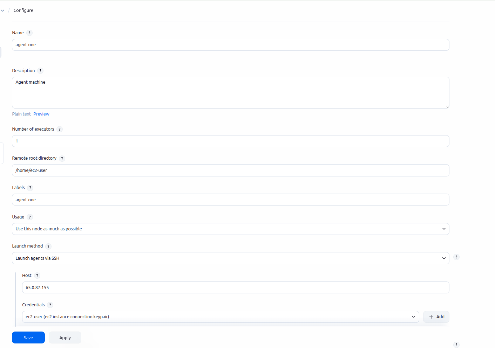

# Jenkins Provisioned, Pipeline as Code

Standing up Jenkins itself, then writing pipelines as code from day one.

### 20.1 Controller & Agent Model

Jenkins splits into two roles. The **controller** (formerly "master") serves the web UI, stores every job's configuration, schedules builds, and holds the plugin/credential state — it orchestrates, it doesn't build. An **agent** (formerly "slave"/"node") is a separate machine or container that connects to the controller and actually runs the pipeline's steps.

!!! danger "Never build directly on the controller"

    The controller has no isolation from what runs on it — a build that exhausts memory, hangs, or gets compromised takes down the one thing coordinating every other job too. Agents exist specifically to keep build workloads (arbitrary code, effectively) away from the process that everything else depends on staying up.

An agent advertises **labels** — arbitrary tags like `linux`, `docker`, or `gpu` — and a pipeline's `agent` directive picks one by label, the same way a Kubernetes pod picks a node by `nodeSelector`:

``` groovy
pipeline {
  agent { label 'linux && docker' }
  stages { stage('Build') { steps { sh 'make build' } } }
}
```

!!! success "Why not just one big controller"

    Separate agents mean a Windows build and a Linux build can run on the same Jenkins instance without one machine needing both toolchains installed, and adding build capacity is "add another agent," not "resize the box everything else depends on." The controller stays a stable, mostly-idle coordination point regardless of how much build traffic the team generates.

#### Why agents exist, beyond just isolation

| Reason | What it actually buys |
|---|---|
| Isolation | Arbitrary, untrusted build code never runs on the one process everything else depends on (the fact-fail above). |
| Horizontal scaling | More build capacity is "provision another agent," not "give the controller a bigger instance" — capacity and coordination scale independently. |
| Environment matching | A label picks the toolchain a build actually needs — a specific OS, a GPU, a licensed tool only installed on one machine — instead of forcing every build to fit whatever the controller happens to have. |
| Parallelism | Multiple agents mean multiple builds genuinely running at once, not queued behind each other on a single executor. |
| Network/resource proximity | An agent can live inside the same VPC, region, or on-prem network as whatever it needs to reach fast — an internal artifact repo, a private database, a specific compliance boundary — without routing the controller itself into that network. |
| Team/security segregation | Folder-scoped agents (20.9) let one team's builds run on infrastructure another team can't touch, without needing a separate Jenkins instance per team. |

#### Types of agents

| Type | How it connects / how long it lives |
|---|---|
| Static (permanent) agent | Added once by hand via **Manage Jenkins → Nodes** and left running indefinitely — one real, named machine (20.3's EC2 example). Simple, but it's idle capacity paid for even when no build is using it. |
| SSH (outbound) agent | The controller initiates the connection, over SSH, to a host it already knows the address of (20.3). Needs the agent host reachable from the controller, not the other way around. |
| Inbound (JNLP/WebSocket) agent | The agent initiates the connection *to* the controller instead — the fix when the agent sits behind NAT or a firewall the controller can't reach inbound, e.g. a build machine on a laptop or in a restricted network. |
| Cloud / ephemeral agent | Provisioned on demand by a plugin (EC2 Fleet, Docker, Kubernetes) when a build needs one, then torn down afterward. No idle cost, and every build starts from a known-clean environment instead of accumulating drift on a long-lived machine. |
| Docker agent | Declared directly in a Jenkinsfile — `agent { docker { image 'node:20' } }` — a fresh, disposable container per build or per stage, with the exact toolchain version pinned in code instead of installed once on a static machine. |
| Built-in node | The controller's own, hidden executor pool — technically able to run builds itself, which is exactly what the fact-fail above says not to rely on. Usually set to 0 executors deliberately on any real controller. |

### 20.2 Installing Jenkins & First-Time Setup

Before anything gets provisioned as code (20.4), it's worth knowing what "installing Jenkins" actually involves by hand — the same principle as terraform.html starting from `ssh-keygen` and a plain resource block before ever reaching a module. Jenkins is a Java application; everything below assumes Java is present first.

| Method | Command | Good for |
|---|---|---|
| Native package (Amazon Linux/RHEL) | `dnf install jenkins`, after adding the Jenkins repo | A long-lived controller on a real instance — this project's approach (20.4) |
| Native package (Debian/Ubuntu) | `apt-get install jenkins`, after adding the Jenkins `apt` repo and signing key | Same idea, different AMI family — the exact `dnf`/`apt-get` distinction from 18.8.1, applied to Jenkins itself now |
| Docker | `docker run -p 8080:8080 -v jenkins_home:/var/jenkins_home jenkins/jenkins:lts` | Trying Jenkins locally, or running it as a container on ECS/EKS instead of a bare EC2 instance |
| WAR file | `java -jar jenkins.war` | Quick, throwaway testing — nothing installed system-wide, nothing left behind but the process |

``` bash
#!/bin/bash
# Amazon Linux / RHEL family
dnf install -y java-17-amazon-corretto
wget -O /etc/yum.repos.d/jenkins.repo https://pkg.jenkins.io/redhat-stable/jenkins.repo
rpm --import https://pkg.jenkins.io/redhat-stable/jenkins.io-2023.key
dnf install -y jenkins
systemctl enable --now jenkins
```

``` bash
#!/bin/bash
# Debian / Ubuntu family
apt-get update
apt-get install -y fontconfig openjdk-17-jre
wget -O /usr/share/keyrings/jenkins-keyring.asc https://pkg.jenkins.io/debian-stable/jenkins.io-2023.key
echo "deb [signed-by=/usr/share/keyrings/jenkins-keyring.asc] https://pkg.jenkins.io/debian-stable binary/" \
  | tee /etc/apt/sources.list.d/jenkins.list
apt-get update
apt-get install -y jenkins
```

!!! note "Java version is a real compatibility constraint"

    Recent Jenkins releases require Java 17 or 21 — an older Java 11 install fails to even start the service, with the actual reason buried in `systemctl status jenkins` or `/var/log/jenkins/jenkins.log` rather than shown anywhere obvious. Check the specific Jenkins version's requirements before assuming whatever Java happens to already be on an AMI is new enough.

#### First-time setup wizard

Jenkins starts on port 8080 by default and, on first boot, is locked behind a one-time password only readable from the server itself:

``` bash
cat /var/lib/jenkins/secrets/initialAdminPassword
```

Unlock Jenkins
:   Paste that password into the setup wizard at `http://<controller-ip>:8080` — proves whoever's completing setup actually has access to the server itself, not just the network port.

Install plugins
:   "Install suggested plugins" is the reasonable default for a first controller — a curated set covering Git, pipelines, and the essentials. "Select plugins to install" is the deliberate route once 20.5's plugin-hygiene principle actually matters — smaller footprint, chosen instead of inherited.

Create the first admin user
:   Skipping this and continuing as the default `admin` account is explicitly offered but shouldn't be taken for anything beyond a five-minute local test — the same reasoning as never leaving a database on its default credentials.

Instance configuration
:   Confirms the URL Jenkins believes it's reachable at — matters later for webhook payload URLs (20.11) and any notification that links back to a build, since a wrong URL here means links that go nowhere.

#### Operating Jenkins as a systemd service

The native package installs Jenkins as a real systemd unit, not just a process someone starts by hand — the same start/stop/status vocabulary as any other Linux service applies directly:

``` bash
systemctl start jenkins      # start it now
systemctl stop jenkins       # stop it now
systemctl restart jenkins    # e.g. after a config or plugin change that needs a restart
systemctl status jenkins     # is it actually running, and since when
systemctl enable jenkins     # survive a reboot -- already done by --now during install
journalctl -u jenkins -f     # follow the service's own logs live
```

Two files control how the service actually behaves, separate from anything configured in the Jenkins UI itself:

`/etc/sysconfig/jenkins` (RHEL family) / `/etc/default/jenkins` (Debian family)
:   Environment variables read by the systemd unit before Jenkins even starts — `JENKINS_PORT` (default 8080), `JENKINS_HOME` (where job data actually lives), `JENKINS_USER` (which OS user the process runs as). Changing the port here, not in the Jenkins UI, is what actually takes effect — the UI has no setting for its own listen port.

`JAVA_OPTS` / `JENKINS_JAVA_OPTIONS`
:   JVM flags passed to the underlying Java process — heap size (`-Xmx2g`), most commonly, since Jenkins is a long-running JVM and the default heap can be too small for a controller running many jobs.

!!! danger "A config file change needs a restart, not a reload"

    Neither of the files above is watched live — editing `JENKINS_PORT` or `JAVA_OPTS` and expecting it to take effect immediately is the same mistake as expecting a changed environment variable to reach an already-running process anywhere else. `systemctl restart jenkins` is what actually applies it.

!!! success "Verifying it actually worked"

    `systemctl status jenkins` showing `active (running)`, plus the setup wizard actually loading in a browser on port 8080, is the full confirmation — no separate health check exists beyond "does the service report running and does the UI respond."

!!! note "Provisioning this with Terraform lives in the Terraform week"

    Wrapping this exact install script into an `aws_instance`'s `user_data`, with `JENKINS_HOME` on its own EBS volume for durability, is covered in terraform.html 18.10 — that's fundamentally a Terraform/infrastructure topic (provisioning compute), not a Jenkins-specific one, so it lives with the rest of Week 4's real resource patterns rather than here.

### 20.3 Connecting an Agent Node via SSH

A controller with no agents attached still has nowhere to actually run a build (20.1). **Manage Jenkins → Nodes → New Node** creates one — "Permanent Agent" for a real, long-lived machine like an EC2 instance, as opposed to a cloud-provisioned, one-build-and-gone agent. The SSH launch method needs nothing pre-installed on the target beyond SSH access and a working Java — the controller pushes its own agent jar over the connection itself.



*A permanent agent node's Configure screen — SSH launch method, pointed at one EC2 instance*

Name
:   The node's identity inside Jenkins — shown in build history and node listings, independent of the label used to target it.

Remote root directory
:   Where the agent jar and every job's workspace get written on the remote machine — `/home/ec2-user` above, which is also why the earlier pipeline output showed `Running on agent-one in /home/ec2-user/workspace/CICD`.

Labels
:   What a pipeline's `agent` directive (20.1) actually matches against — set to `agent-one` here, matching the node's own name, but the two are independent; a label can be shared across several nodes, or differ from the node's name entirely.

Usage
:   "Use this node as much as possible" lets the controller schedule any matching job here; the alternative, "Only build jobs with label expressions matching this node," reserves it for jobs that explicitly ask for it and nothing else.

Launch method: Launch agents via SSH
:   Host and Credentials (an SSH keypair, added to Jenkins' credentials store — 20.9) are all this method needs. Jenkins opens the connection itself on save, or whenever the node is manually relaunched.

#### What actually happens when it connects

``` text
[SSH] Opening SSH connection to <agent-host>:22.
[SSH] Authentication successful.
[SSH] Starting sftp client.
[SSH] Copying latest remoting.jar...
[SSH] Starting agent process: cd "/home/ec2-user" && java -jar remoting.jar -workDir /home/ec2-user
Agent successfully connected and online
```

Underneath the UI, this is exactly the SSH-file-transfer-plus-remote-command pattern from terraform.html's own `ssh-keygen`/`scp` fundamentals — Jenkins just automates it: connect, copy its agent jar over SFTP, then run it with `java -jar` on the other end.

!!! danger ""java: command not found" here means Java is missing, not Jenkins misconfigured"

    The SSH connection and the SFTP copy can both succeed — the log shows authentication working and `remoting.jar` transferring cleanly — and the launch can still fail at the very last step, `bash: line 1: java: command not found` / `Agent JVM has terminated. Exit code=127`, because there's simply no `java` on the agent host's `PATH`. A common real cause: a boot-time install script (this project's own 20.2/terraform.html 18.10 pattern) that ran `dnf install`/`yum install` without `-y` — harmless interactively, but silently skipped during a non-interactive `user_data` boot with no terminal to answer its confirmation prompt. Fix on the agent host directly (install Java, or relaunch the instance with the corrected script) — nothing about this is a Jenkins-side problem.

#### Referencing the node from a pipeline

``` groovy
pipeline {
    agent { label 'agent-one' }
    stages {
        stage('Hello') { steps { echo 'Hello World' } }
    }
}
```

!!! danger "An unquoted label is Groovy math, not a string"

    `agent { label agent-one }` — no quotes — doesn't fail because of anything wrong with the label. Groovy parses the bareword `agent-one` as the expression `agent - one`, subtracting two undefined variables, which throws `groovy.lang.MissingPropertyException: No such property: agent` from inside Jenkins' own `ModelInterpreter.inDeclarativeAgent` — a genuinely confusing error for what's really just a missing pair of quotes. `label 'agent-one'` is the fix, same as quoting any other Groovy string.

!!! note ""Still waiting to schedule task ‘agent-one’ is offline""

    A pipeline whose `agent` label matches only a currently-disconnected node queues indefinitely — there's no default timeout. **Manage Jenkins → Nodes →** that node shows its live status and log; clicking **Launch agent** retries the SSH connection without touching the pipeline itself, and an already-queued build picks up automatically the moment the node comes back online. On a memory-constrained instance (a `t3.micro`'s 1GB strained by a JVM plus the remoting process), a node can connect successfully and then drop again shortly after — `dmesg | grep -i kill` on the agent host is worth checking for an OOM kill if that keeps happening.

#### A node that's "online" but still fails every build

Two more failure modes worth knowing, both diagnosed on this same real agent — neither one looks like a connection problem at first, and neither one is fixed by the "Launch agent" click above.

!!! danger "A fix applied after the agent connected doesn't apply until it reconnects"

    Adding `ec2-user` to the `docker` group (`usermod -aG docker`) fixes the account immediately — a brand-new SSH login, or even `id ec2-user`, shows it right away. But Linux fixes a process's supplementary groups at the moment it's *created*, not continuously — the agent's already-running `remoting.jar` process keeps failing with `permission denied` on `/var/run/docker.sock` forever, because it was forked before the fix existed. Confirmed here directly: `ps -o etime= -p <pid>` showed the process had been alive for 48 minutes, well before the group was added. The fix isn't re-running the build — it's forcing a new process: **Manage Jenkins → Nodes → agent-one → Disconnect**, wait for it to show offline, *then* **Launch agent**. Clicking "Launch agent" while Jenkins still considers the node connected is often a no-op, since Jenkins has no reason to kill a channel it doesn't believe is broken.

!!! note "The identical symptom, from a completely different cause, on a freshly-launched instance"

    The same "permission denied" error can reappear on a brand-new instance too — even though `usermod -aG docker` is baked into `user_data` (20.2) and should have already run. The reason: `user_data` executes asynchronously in the background after boot, and SSH typically becomes reachable *before* it finishes — especially with a `yum update -y` running first, which alone can take over a minute. If Jenkins' agent connects and starts its process during that window, it's fixed at the pre-`usermod` state, for a boot-timing reason rather than a manual-fix-timing reason. Same fix either way: Disconnect, wait, Launch agent — by the time you're re-attempting, `user_data` has almost always finished.

!!! note ""Disk space is below threshold" when the disk isn't actually full"

    Jenkins' built-in **Free Temp Space** monitor took this same agent offline with "Only 456.59 MiB out of 456.62 MiB left on /tmp" — which reads like a full disk, but `df -h` on the box told a different story: `/tmp` was a `tmpfs` (RAM-backed) at 0% used, completely empty, while the real root disk had gigabytes free. The catch: this `t3.micro`'s `/tmp` is sized to roughly half its 1GB of RAM — a hard ceiling around 457MB that can never satisfy the monitor's default 1GiB-free requirement, no matter how empty it is. Not a leak, not real pressure — an instance-sizing mismatch against a monitor default. Fixed via the small gear/settings icon on the **Manage Jenkins → Nodes** list (or **Manage Jenkins → System**'s "Free Temp Space" section): lower the threshold to something the instance can actually reach, e.g. `100MiB`.

### 20.4 Job Types: What "New Item" Actually Offers

Clicking **New Item** in Jenkins shows every kind of thing it can create, in one screen — worth knowing the full list before defaulting to whichever one a tutorial happened to use. An overview for now; each gets its own use-cases/pros-cons/step-by-step treatment later.

| Item type | What it's for |
|---|---|
| Pipeline | Build, test, and deploy using a `Jenkinsfile` (20.10). Supports stages, parallel work, and running steps across multiple agents. |
| Freestyle project | The classic, UI-configured job type — checks out from up to one SCM, runs build steps serially, then post-build actions like archiving artifacts or sending email. Predates Pipeline-as-code, and still its own CJE exam section (20.11). |
| Multi-configuration project | One job definition run across many combinations automatically — multiple OSes, multiple environments, multiple platform targets — without hand-creating a separate job per combination. |
| Folder | A real namespace, not just a filter — two items can share a name if they live in different folders. The same folder that scopes credentials and permissions in 20.5. |
| Multibranch Pipeline | Scans one repository and creates a Pipeline job per detected branch and pull request automatically (20.10) — no manually creating a job per branch. |
| Organization Folder | One level up from Multibranch Pipeline — scans an entire GitHub org/Bitbucket project for repositories, and creates a Multibranch Pipeline for each one it finds. |

!!! note ""Duplicate an existing item" isn't a type"

    It's the seventh option on the same screen, but it's a shortcut action, not a job type of its own — it just copies an existing item's configuration into a new one, for any type above, as a starting point instead of configuring from scratch.

### 20.5 Pipeline Job Configuration: General, Triggers & the Script Definition

Choosing "Pipeline" as the item type (20.4) opens this configuration screen — the same shape every Pipeline job shares, regardless of what its stages actually do.

#### General

| Option | What it actually does |
|---|---|
| Discard old builds | A retention policy — keep only the last N builds or the last N days. Without it, build history (20.9) grows forever. |
| Do not allow concurrent builds | Serializes runs of *this same job* — a second trigger waits instead of running in parallel. For a job that touches shared state it can't safely share with itself. |
| Do not allow the pipeline to resume if the controller restarts | Jenkins normally tries to resume an in-progress pipeline after a controller restart. Disabling this makes a restart abort the run instead — the right choice when a resumed run risks replaying a non-idempotent step (compute.html 5.6's territory: retries are only safe when the operation tolerates repetition). |
| GitHub project | Just a display link back to the repo's GitHub page — cosmetic, not functional. |
| Pipeline speed/durability override | Trades how often Jenkins persists pipeline state to disk against I/O overhead — safer and slower, or faster and more state lost if the controller crashes mid-run. |
| Preserve stashes from completed builds | A `stash` (files passed between stages/agents) is normally discarded once the build finishes — this keeps it around afterward for inspection. |
| This project is parameterized | The UI equivalent of a Jenkinsfile's `parameters {}` block (20.11) — configured by clicking instead of by code. |
| Throttle builds | Rate-limits how often, or how many concurrently, this job (or a named category of jobs) can run — for protecting a shared resource several different jobs compete for. |

!!! danger "Concurrent-build prevention and throttling solve different problems"

    "Do not allow concurrent builds" only stops *this one job* from overlapping with itself. "Throttle builds" limits a whole category of jobs against each other — useful when five unrelated jobs all hit the same rate-limited API and none of them individually looks like the problem.

#### Triggers

| Trigger | What starts the build |
|---|---|
| Build after other projects are built | Upstream/downstream chaining — this job runs automatically once a named other job finishes. |
| Build periodically | A cron-syntax schedule — the same five-field format as compute.html 5.6's scheduled scaling policies, evaluated in the controller's own timezone. |
| GitHub hook trigger for GITScm polling | The real webhook (20.12) — GitHub pushes an event to Jenkins the moment something happens, no delay. |
| Poll SCM | The older mechanism 20.12 contrasts against webhooks directly — also cron-syntax, but Jenkins checks the repo on a timer instead of being told immediately. |
| Trigger builds remotely | An authenticated URL with a token, callable by an external script or system to start a build without needing full Jenkins API credentials. |

#### The script definition itself

Further down the same screen, "Pipeline script" is one of two ways to tell Jenkins what to actually run:

``` groovy
pipeline {
    agent any

    stages {
        stage('Hello') {
            steps {
                echo 'Hello World'
            }
        }
        stage('Create Folder') {
            steps {
                sh "mkdir -p devops"
            }
        }
        stage('Bye') {
            steps {
                echo 'Bye'
            }
        }
    }
}
```

!!! danger "This is the opposite of what 20.10/20.11 recommend"

    "Pipeline script" types the Groovy directly into this one field, saved only in Jenkins' own job configuration — invisible to git history, code review, or branch-per-Jenkinsfile discovery (20.12's Multibranch Pipeline). "Pipeline script from SCM" is the other option on the same dropdown — pointing at a `Jenkinsfile` checked into the repository, which is what every example in 20.10 onward assumes. Fine for a five-minute "does Jenkins work at all" test; the wrong choice for anything meant to last.

Use Groovy Sandbox
:   Checked by default — restricts which Java/Groovy APIs a script can call, since arbitrary unrestricted Groovy can do real damage running on the controller. Unchecking it requires an administrator to manually approve the script before it can run.

Pipeline Syntax (link)
:   A built-in generator that produces correct step syntax by filling out a form, instead of memorizing every step's exact arguments from documentation.

### 20.6 Real Pipeline Walkthrough: Git, Credentials & Docker

Everything from 20.1–20.5 in one real, working pipeline: cloning a private repository with a scoped credential, checking out a specific branch, and building a Docker image from the result. Every failure quoted below actually happened, in that order, on a real agent.

#### What the agent host needs installed first

Neither `git` nor `docker` ships on a base Amazon Linux 2023 AMI — both have to be installed explicitly, in the same `user_data` script that installs Java (20.2/18.10):

``` bash
#!/bin/bash
sudo yum update -y
sudo yum install -y java-21-amazon-corretto git docker
sudo systemctl enable --now docker
sudo usermod -aG docker ec2-user
```

!!! danger "Package names still don't transfer across distros"

    The same lesson as 20.2's `openjdk-21-jre`: that name is Debian/apt's convention and doesn't exist on Amazon Linux. Docker has the identical trap — `docker.io` is the Debian/Ubuntu apt package; Amazon Linux 2023's `yum`/`dnf` repos just call it `docker`. Running `yum install docker.io` here fails immediately with "No match for argument," the same failure shape as the Java naming mismatch, just one distro-naming gotcha away from a different tool.

`usermod -aG docker ec2-user` adds the agent's user to the group that owns `/var/run/docker.sock` (normally `root:docker`, mode `660`) — without it, every `docker` command fails with `permission denied while trying to connect to the Docker daemon socket`, even though the daemon itself is running fine.

!!! danger "Group membership doesn't apply to an already-running process"

    Linux fixes a process's supplementary groups at the moment it's created — editing `/etc/group` afterward doesn't retroactively update a process that's already running. If the Jenkins agent's `java -jar remoting.jar` process started *before* `usermod -aG docker` ran, that specific process keeps failing with "permission denied" on the docker socket forever, even though a brand-new SSH login to the same box (and even `id ec2-user`) correctly shows `docker` in its group list. The account is fixed; the already-running process isn't. Confirmed here by checking the process's own uptime (`ps -o etime= -p <pid>`) — 48 minutes old, well before the fix.

!!! success "The actual fix: kill the old process, don't just re-run the build"

    On the node's own page (**Manage Jenkins → Nodes → agent-one**), click **Disconnect** first — this is easy to miss, and re-running a build without it just reuses the same stale, already-connected process. Only after it shows offline does **Launch agent** actually start a brand-new `remoting.jar` process, one that reads `/etc/group` fresh and correctly picks up the new membership.

#### Authenticating to a private GitHub repository

Cloning a public repo needs no credential at all — the earlier "No credentials specified" line in a build log is completely normal for those. A private repo fails that same anonymous clone outright, so a credential has to exist in Jenkins before the `git` step can succeed.

1. Generate a GitHub Personal Access Token, scoped narrowly
:   GitHub → **Settings → Developer settings → Personal access tokens → Fine-grained tokens → Generate new token**. Repository access: only the one repo needed. Permissions: **Contents: Read-only** — a clone needs nothing more.

2. Store it in Jenkins' credentials store, never in the pipeline script
:   **Manage Jenkins → Credentials → System → Global credentials → Add Credentials**. Kind: **Username with password**. Username: the GitHub username. Password: the token. ID: a memorable string (`github-pat` below) referenced from the pipeline.

3. Reference it from the `git` step by that ID
:   `credentialsId: 'github-pat'` — Jenkins resolves the actual token at checkout time and masks it out of console logs; the pipeline script itself never contains the secret value (20.9's credentials-store principle applies here directly).

An SSH deploy key is the alternative: generate a keypair, add the *public* half under the repo's **Settings → Deploy keys** (read-only), add the *private* half to Jenkins as an **"SSH Username with private key"** credential, and use a `git@github.com:...` URL instead of HTTPS. More setup, but scoped to exactly one repo rather than an account-wide token — worth it across several private repos.

#### The `git` step: url, credentialsId, branch — and beyond

| Parameter | What it does |
|---|---|
| `url` | The remote to clone — HTTPS or SSH form, matching whichever credential type is in use. |
| `credentialsId` | The Jenkins credentials-store ID to authenticate with. Omitted entirely for a public repo, as the earlier "No credentials specified" log line showed. |
| `branch` | A plain branch name — slashes included, e.g. `holding/ui`, a perfectly normal git branch name — resolved against the remote. Also accepts a tag ref directly, e.g. `refs/tags/v1.2.3`, for building from a specific release point instead of a moving branch. |
| `changelog` / `poll` | Booleans controlling whether this checkout contributes to Jenkins' build-changelog UI and SCM-polling baseline — usually left at their defaults unless a job deliberately checks out more than one repository. |

After checkout, Jenkins exposes what it just cloned as environment variables — `env.GIT_COMMIT` (the full SHA) and `env.GIT_BRANCH` — usable straight in a later stage, e.g. tagging a Docker image by commit instead of only by build number:

``` groovy
sh "docker build -t investor-pro:${env.GIT_COMMIT.take(7)} ."
```

The full commit message isn't exposed as an env var, but a plain `git log` in a `sh` step captures it just as easily, once the repo is checked out:

``` groovy
def msg = sh(script: "git log -1 --pretty=%B", returnStdout: true).trim()
```

#### The pipeline, line by line

The actual working pipeline this section is built from:

``` groovy
pipeline{
    agent {label 'agent-one'}
    stages{
        stage("Code"){
            steps{
                echo "This is cloning the code"
                git credentialsId: 'github-pat', url: 'https://github.com/Fahad-Md-Kamal/investor-pro.git', branch:"holding/ui"
                echo "Code cloned successfully"
            }
        }
        stage("Build"){
            steps{
                echo "This is building the code"
                sh "docker build -t investor-pro:${env.BUILD_NUMBER} -t investor-pro:latest ."
            }
        }
        stage("Test"){
            steps{
                echo "This is testing the code"
            }
        }
        stage("Deploy"){
            steps{
                echo "This is deploying the code"
            }
        }
    }
}
```

`pipeline { ... }`
:   The declarative-syntax root block (20.11) — everything inside it is Jenkins-managed structure, not arbitrary Groovy.

`agent {label 'agent-one'}`
:   Pins this entire pipeline to the one node advertising the label `agent-one` (20.1, 20.3) — every stage below runs on that same machine, in the same workspace.

`stages { ... }`
:   The container for every named phase of the build — purely organizational, holds one or more `stage` blocks.

`stage("Code") { ... }`
:   One named phase, shown as its own box in Jenkins' pipeline visualization. The name is just a label — `"Code"` could as easily be `"Checkout"`.

`steps { ... }`
:   The actual commands run inside a stage — every stage needs exactly one.

`echo "..."`
:   Prints a line to the build's console log — used here purely for readability while watching a run, no functional effect.

`git credentialsId: ..., url: ..., branch: ...`
:   The simplified checkout step (this section, above) — clones `url` at `branch`, authenticating with the named credential.

`sh "..."`
:   Runs a shell command on the agent, in the current stage's workspace — here, the actual `docker build`.

`${env.BUILD_NUMBER}`
:   A Jenkins built-in environment variable — the current job's build number, incrementing every run. Used here as an image tag so every build produces a distinct, traceable image, alongside a floating `latest` tag for convenience.

#### The Docker build itself

`docker build ... .` uses `.` — the workspace root — as its build context, which works because the `git` step above clones directly into the workspace root rather than a subdirectory; the real `Dockerfile` at the repo's top level is found without needing a `-f` path. Two tags in one command (`-t investor-pro:${env.BUILD_NUMBER} -t investor-pro:latest`) apply both at once, from a single build — no need to build twice or run a separate `docker tag`.

!!! success "What actually running this looked like"

    Code stage: clone succeeds, credential accepted, correct branch checked out. Build stage: multi-stage `apt-get`/`uv sync` output streams through exactly as it would locally, image exported and tagged. Test and Deploy stages (still placeholder `echo`s here) run last. `Finished: SUCCESS` — the same pipeline shape 20.11's declarative Jenkinsfile builds on next, just with real steps instead of placeholders.

### 20.7 Hardening the Deploy Stage: Frontend Builds, Dockerfile Gotchas & Cleanup

20.6's pipeline reaches `Finished: SUCCESS` — but a green build is not the same as a working deployment. Everything below is a real gap between the two, found by actually opening the deployed URL rather than trusting the pipeline's own exit code.

#### A stage can only have one `steps` block

``` groovy
stage("Code"){
    steps{ /* clone */ }
    steps{ /* copy .env */ }   // invalid -- a second steps block
}
```

!!! danger ""Expected one steps block, but got 2""

    A declarative `stage` allows exactly one `steps` block. This fails before a single step runs — Jenkins rejects the whole script at validation time, not partway through execution. The fix is just merging both step lists into the one block the stage is allowed to have.

#### Building a frontend on the same agent that's already tight on resources

A `t3.micro` agent (1GB RAM, an 8GB disk already shared with Jenkins itself and every Docker image built) is a genuinely hard place to run `npm install` and `npm run build` — this project hit disk pressure, and separately investigated (and rejected) `nvm` as the way to get Node onto the box at all.

!!! danger "nvm installs Node for the wrong user, in a way Jenkins can't see anyway"

    `user_data` runs as **root**, not `ec2-user` — so `curl ... | bash` followed by `nvm install 24` puts Node under `/root/.nvm`, invisible to the account Jenkins actually builds as. Fixing that user mismatch still wouldn't be enough: nvm works by having an *interactive* shell's `~/.bashrc` source `nvm.sh` and rewrite `PATH` — Jenkins' SSH-launched agent (20.3) and every pipeline `sh` step run a **non-interactive, non-login** shell, which never sources `~/.bashrc`. The same shape of bug as the `docker` group issue below: works fine when you SSH in by hand, silently doesn't apply in the actual automated context. A distro package (NodeSource's `yum`/`dnf` repo) avoids both problems at once — the binaries land on the system `PATH` for every user and every shell type, no sourcing required.

!!! success "The fix that actually held: don't build the frontend on the agent at all"

    Rather than fighting a tiny instance's resources for every build, the frontend gets built once (locally, or wherever's convenient), and the built `dist/` output — `index.html` plus a hashed `assets/` folder, Vite's default output — is committed directly into the repo under `src/webapp/frontend_dist/`. Since the Dockerfile already does `COPY src ./src`, the built assets ride along automatically, with zero Node.js on the agent, zero npm install, zero frontend build step in the pipeline at all. The backend's own path resolution matches this exactly: `FRONTEND_DIST_ROOT = APP_ROOT / "frontend_dist"`, i.e. right next to `app.py` inside `src/webapp/` — the same directory the Docker image already contains.

#### A container that "runs" but never actually starts the app

``` text
STATUS: Restarting (0) 3 seconds ago
COMMAND: "python3"
```

!!! danger "No CMD in the Dockerfile means the base image's default runs instead"

    Exit code `0`, not a crash — the tell. With no `CMD`/`ENTRYPOINT` in the Dockerfile, `docker run` falls back to `python:3.12-slim`'s own default command: a bare `python3` interpreter. Detached (`-d`), its stdin is closed immediately, the REPL hits EOF and exits cleanly, and `--restart unless-stopped` loops that forever. No application code ever runs, which is also why `docker logs` came back completely empty — there was nothing to log. Fix: `CMD ["python3", "main.py"]`, pointed at the repo's actual ASGI entrypoint.

#### Dockerfile CMD vs docker-compose's command

Once a `docker-compose.yml` exists alongside the Dockerfile, its `command:` key fully **overrides** the Dockerfile's `CMD` — it doesn't merge with it. Precedence, highest to lowest: a command passed directly on the CLI, then a compose service's `command:`, then the Dockerfile's own `CMD` as the last-resort fallback for a bare `docker run` (only different if the Dockerfile uses `ENTRYPOINT` instead — then `CMD`/`command:` become arguments *appended to* the entrypoint rather than replacing it).

!!! danger ""It works under docker-compose but not under a bare docker run" is a real, common gap"

    A compose file can quietly fix a problem a bare `docker run` still has — here, `docker-compose.yml` pointed `DATABASE_URL` at `postgres:5432` (the Postgres service's *name*, resolved over compose's own Docker network), while the app's own `.env` still says `@localhost:5432`. Inside any container, `localhost` means that container itself, not a sibling container and not the host. A Jenkins `Deploy` stage doing a bare `docker run` (this project's own pipeline, for simplicity) never gets that compose-level override, so the app starts, tries to reach a database on its own loopback, and fails — a problem invisible until someone actually checks whether the deployed app works, not just whether the pipeline went green.

#### The actual fix: let a Makefile target run docker-compose, not the Jenkinsfile itself

Rather than re-implementing `docker-compose.yml`'s networking logic inside the pipeline, the `Deploy` stage was rewritten to call the project's own `Makefile`:

``` groovy
sh "make start"
```

``` text
# Makefile
start:
	docker compose up -d --build
```

!!! success "This fixes the DATABASE_URL/localhost problem for good"

    `docker compose up` builds the app image *and* starts it alongside Postgres on compose's own network, with compose's own environment override taking effect (`DATABASE_URL: postgresql://...@postgres:5432/...`) — the exact override a bare `docker run` could never see. One Makefile target now matches whatever the project's maintainers already use locally, instead of a second, parallel deployment recipe hand-written inside the Jenkinsfile that can quietly drift from it.

!!! danger "echo "make start" runs nothing — it just prints the words"

    A one-character-category mistake with a completely silent failure mode: writing `echo "make start"` instead of `sh "make start"` prints the literal text `make start` to the console log and does nothing else. The build still reaches `Finished: SUCCESS`, because nothing in an `echo` step can fail — there's no command being run to fail. The tell in the log is structural, not textual: a real shell step shows up as `[Pipeline] sh` followed by a line starting with `+` (the shell echoing what it's about to run); an `echo` step shows only `[Pipeline] echo` and the string itself, with no `+` line anywhere. A green pipeline that changed nothing is a strong sign to check for exactly this.

!!! danger "Yet more tools a base AL2023 AMI doesn't have"

    Running `make start` surfaced two more gaps in the same "assume nothing is preinstalled" pattern as 20.2's Java, this section's `git`/`docker`, and 20.7's Node: `make` itself isn't on the base image (`make: command not found`, fixed with `yum install -y make`), and even once Docker Compose's CLI plugin is installed, `docker compose build` separately requires the **Buildx** plugin — "`compose build requires buildx 0.17.0 or later`" — which is a *different* plugin binary, not bundled with Compose itself. Neither AL2023's `yum` repos nor Docker's own package ship it directly; the fix is downloading the plugin binary from Buildx's GitHub releases into the same `/usr/libexec/docker/cli-plugins/` directory Compose's own plugin lives in. Since Buildx's release asset name embeds its version number (`buildx-v0.37.1.linux-amd64`, not a stable filename), resolving the latest tag via GitHub's API first avoids hand-typing a version number into the script that will eventually go stale.

#### Every build leaves behind a full image, forever, unless something removes it

``` groovy
sh """
    docker image prune -f
    docker images investor-pro --format '{{.Tag}}' \\
        | grep -vE '^(latest|${env.BUILD_NUMBER})\$' \\
        | xargs -r -I {} docker rmi investor-pro:{} || true
"""
```

!!! danger "Disk usage that grows by one full image every single build"

    `docker build -t investor-pro:${env.BUILD_NUMBER} -t investor-pro:latest .` creates a brand-new ~1.3GB image on every run, and nothing removes the previous numbered tag automatically. By build 18, if none of the earlier 17 images had ever been cleaned up, that alone is many times the agent's entire 8GB disk — exactly the kind of accumulation that trips a low-disk-space monitor (or the Free Temp Space false-positive in 20.3) and takes the agent offline, with the actual cause being old, unused images rather than anything about the current build. The snippet above runs right after the new container is already live, so there's no window where the image actually in use gets deleted out from under it — it keeps only `latest` and the build currently deployed, and reclaims everything else, every time.

#### Deploying the wrong branch entirely

!!! danger "A Jenkinsfile pointed at a branch that never got the fix merged into it"

    Every fix above — the Dockerfile `CMD`, the `frontend_dist` restructuring — happened on a feature branch. Pointing the `git` step's `branch:` at `main` instead brought back the *exact same* "bare `python3`, exit 0" crash loop from earlier, because `main`'s own Dockerfile still had no `CMD` at all — the two branches had genuinely diverged (`git merge-base --is-ancestor` confirmed neither contained the other), each carrying real, non-overlapping work. There's no Jenkins-side fix for this — it's a git problem wearing a deployment failure's clothes. `git log --oneline branchA..branchB` shows what one branch has that the other doesn't; merging (not rebasing, once a branch may already be deployed from) brings both sets of changes together before pointing the pipeline back at whichever branch is meant to be the source of truth.

### 20.8 Point-to-Point Deploy: investor-pro, Start to Finish

20.6 and 20.7 are the debugging story — every individual bug, in the order it was actually found. This is the destination: the current, complete pipeline for this project, clone to a fully running, fully-seeded application, with nothing left commented out or half-working. Five stages, each doing exactly one job.

``` groovy
pipeline{
    agent {label 'agent-one'}
    stages{
        stage("Code"){
            steps{
                git credentialsId: 'github-pat', url: 'https://github.com/Fahad-Md-Kamal/investor-pro.git', branch:"main"
                sh "mv .env.example .env"
            }
        }
        stage("Test"){
            steps{
                echo "This is testing the code"
            }
        }
        stage("Deploy"){
            steps{
                sh "make start"
            }
        }
        stage("Setup-Data"){
            steps{
                sh """
                    mkdir -p data/raw
                    unzip -o stock-data.zip -d ./data/raw/amarstock
                """
            }
        }
        stage("Ingest All Data"){
            steps{
                sh "docker compose exec -T app python -m src.ingest_data --source all"
            }
        }
    }
}
```

| Stage | What it does | Why it's built this way |
|---|---|---|
| Code | Clones the repo with a scoped credential (20.6), checks out `main`, and turns the committed `.env.example` into the real `.env` the app and compose both read from. | Every later stage assumes `.env` already exists — nothing else in the pipeline creates it. |
| Test | Still a placeholder. A real test suite would run here, before anything gets deployed — failing fast on broken code beats deploying it and finding out from Setup-Data or Ingest instead. | Ordered before Deploy deliberately, even while empty — the position is part of the design, not just the content. |
| Deploy | `make start` → `docker compose up -d --build` (20.7): builds the app image and starts it alongside Postgres, on compose's own network, with compose's environment override correctly pointing `DATABASE_URL` at the `postgres` service rather than `localhost`. | One Makefile target instead of hand-rolled `docker build`/`docker run` in the Jenkinsfile — the pipeline never re-implements deployment logic the project already maintains for local dev. |
| Setup-Data | Unzips the project's own bundled sample dataset (`stock-data.zip`, committed to the repo — no external download, no credentials needed) onto the agent's workspace. | `-o` forces silent overwrite (20.7's non-interactive-shell lesson) — a reused workspace's stale extracted files would otherwise stall the stage on an unanswerable prompt. |
| Ingest All Data | Runs the actual ingestion *inside* the running `app` container via `docker compose exec`, not on the bare agent host. | The container already has Python, `uv`, and every dependency from `uv sync` baked in at build time — the agent host deliberately has none of that, so ingestion has to run where the environment actually exists. |

!!! note "One quiet dependency between Setup-Data and Ingest All Data"

    `docker-compose.yml`'s `app` service mounts `./data:/app/data` — without that volume, the files **Setup-Data** unzips onto the host workspace would be invisible to the container **Ingest All Data** execs into, since every container has its own isolated filesystem regardless of which host directory the exec'ing shell happens to be in. The two stages only work together because of a line in a file neither one directly touches.

!!! success "What "point-to-point" actually means here"

    Starting from a bare EC2 instance with only `install_apache.sh`'s tools on it (Java, git, Docker, Compose, Buildx, make — 20.6/20.7) and an empty Jenkins workspace, this pipeline alone produces a running FastAPI app, a healthy Postgres database, and a fully populated dataset — no manual SSH step, no console click beyond pressing Build. Every stage above exists because a version without it was tried first and failed in exactly the way 20.6/20.7 describe.

### 20.9 Plugin Hygiene, the Credentials Store & Folder-Level Security

Three separate concerns that all show up under "Manage Jenkins," easy to conflate.

#### Plugin hygiene

Every installed plugin is both an attack surface and a maintenance burden — each one can introduce its own vulnerabilities, and each one needs updating independently. Install only what a pipeline actually needs, keep an inventory of what's installed and why, and pin versions rather than auto-updating blindly (the same reasoning as 15.2's provider version pinning, applied to Jenkins' own plugin ecosystem).

#### The credentials store

Jenkins has a built-in, encrypted credential store (*Manage Jenkins → Credentials*) — AWS keys, SSH keys, tokens are added there once and referenced by ID from a `Jenkinsfile`, never hardcoded into pipeline code:

``` groovy
withCredentials([usernamePassword(credentialsId: 'ecr-creds', usernameVariable: 'USER', passwordVariable: 'PASS')]) {
  sh 'docker login -u $USER -p $PASS ...'
}
```

!!! danger "A credential ID in a Jenkinsfile is not the credential"

    `credentialsId: 'ecr-creds'` is just a lookup key — the actual secret value never appears in the pipeline source, never gets committed to the repo, and Jenkins actively masks it out of build console logs. Anyone who can edit the Jenkinsfile can use the credential, but they can't read its value from the code itself.

#### Folder-level security

Folders aren't just organization — they're a permission and credential-scoping boundary. A credential added inside a folder is only visible to jobs inside that same folder, and role-based/matrix security can grant a team full control over their own folder's jobs without touching anyone else's. This is what makes multi-team Jenkins viable on one shared controller instead of needing a separate instance per team.

### 20.10 Backing Up JENKINS_HOME

`JENKINS_HOME` holds everything: every job's configuration, full build history, encrypted credentials, and every installed plugin's binary. Losing it is losing the entire Jenkins instance's identity, not just the compute it happened to run on.

|  | EBS snapshot | ThinBackup (plugin) |
|---|---|---|
| What it captures | The entire volume, byte for byte | Job configs, build records, and credentials specifically — Jenkins-aware |
| Restore unit | The whole volume, as one point in time | Selectable — restore just job configs without touching build history, or vice versa |
| Where it lives | Infra-level (terraform.html 18.10's EBS volume) — same mechanism as any other point-in-time recovery (databases.html 7.2's RDS backups) | Jenkins-level, scheduled from inside the Jenkins UI itself |

!!! danger "An untested backup is a hope, not a backup"

    The same principle from every other backup strategy in this project applies here without modification: a snapshot that's never been restored is unverified. Actually restoring a `JENKINS_HOME` snapshot onto a fresh controller at least once, before it's needed for real, is what turns "we take backups" into "we know recovery actually works."

### 20.11 The Declarative Jenkinsfile

A `Jenkinsfile` is Jenkins' equivalent of a Terraform config — a checked-in file describing a pipeline as code, instead of clicking through the UI to define a job.

``` groovy
pipeline {
  agent { label 'linux' }

  parameters {
    choice(name: 'ENVIRONMENT', choices: ['dev', 'stg'], description: 'Target environment')
  }

  environment {
    AWS_REGION = 'ap-south-1'
  }

  stages {
    stage('Test') {
      steps { sh 'npm test' }
    }
    stage('Deploy') {
      when { branch 'main' }
      steps { sh "./deploy.sh ${params.ENVIRONMENT}" }
    }
  }

  post {
    failure { echo 'Notify the team -- build failed' }
    always  { cleanWs() }
  }
}
```

`agent`
:   Where this pipeline runs — a label (20.1), a specific Docker image, or `none` if each stage declares its own.

`parameters`
:   Build-time user input — a dropdown, a string field, a checkbox — collected before the pipeline starts, referenced as `params.NAME`.

`environment`
:   Environment variables available to every step in the pipeline (or scoped to just one `stage` if declared inside it instead).

`when`
:   Guards a `stage` — here, the `Deploy` stage only actually runs on the `main` branch, though it's still evaluated (and skipped) on every other branch's run.

`post`
:   Runs after the pipeline finishes, regardless of outcome — `always`, `success`, `failure`, and others let cleanup or notification logic depend on how the run ended, the closest Jenkins equivalent to a `try`/`finally`.

### 20.12 Multibranch Pipelines, Webhooks & Shared Libraries

Three pieces that turn "one Jenkinsfile" into "a real CI setup serving a whole repository."

#### Multibranch pipeline

Instead of one job per branch created by hand, a multibranch pipeline job scans a repository and automatically creates (and destroys) a pipeline run per branch and per pull request — each one running the *same* `Jenkinsfile`, checked into that specific branch, so a feature branch can even modify its own pipeline before merging.

#### Webhooks

Without a webhook, Jenkins has to poll the repository on a timer to notice new commits — slow, and wasteful when nothing's changed. A webhook has GitHub/GitLab push an event to Jenkins the moment a commit or PR happens, triggering the build immediately instead of waiting for the next poll.

#### Shared libraries

A shared library is a separate git repository of reusable Groovy pipeline code (conventionally under `vars/` and `src/`), loaded into any Jenkinsfile that needs it:

``` groovy
@Library('platform-shared-lib') _

pipeline {
  agent { label 'linux' }
  stages {
    stage('Deploy') {
      steps { deployToEcs(service: 'order-service', environment: 'dev') }
    }
  }
}
```

!!! success "The same reasoning as a Terraform module"

    `deployToEcs(...)` above is a function defined once in the shared library and called from every pipeline that needs to deploy to ECS — the exact same motivation as extracting a Terraform module (16.6): once the same handful of steps shows up in a third Jenkinsfile, that's the signal to stop copy-pasting Groovy and put it in one place every pipeline calls instead.

### 20.13 Certified Jenkins Engineer (CJE)

The external validation for Jenkins specifically, the way terraform.html 19.9 covers Terraform's — CloudBees' [Certified Jenkins Engineer (CJE)](https://university.cloudbees.com/certification-guide-and-information) exam, last updated September 2023. Worth knowing before searching further: CloudBees retired a similarly-named *CCJE* (Certified CloudBees Jenkins Engineer) credential back in 2022 — CJE, without the extra "C," is the one still active.

|  |  |
|---|---|
| Format | 60 multiple-choice questions, 90 minutes |
| Passing score | 66% |
| Prerequisites | None formally, though CloudBees recommends real hands-on Jenkins experience first |
| Tests against | Open-source Jenkins core (not CloudBees CI/Operations Center specifically) |

#### The four exam domains

1. **Jenkins Fundamentals** — core CI/CD concepts, jobs and builds, source code management integration, plugins, security (authentication/authorization), the REST API
2. **Jenkins Administration** — installation, distributed builds, controller/agent configuration, credentials, artifact and fingerprint management, notifications
3. **Pipeline (Build Technologies)** — declarative pipeline syntax, stages and steps, multibranch pipelines, shared libraries, promotion strategies, upstream/downstream triggering
4. **Freestyle (Build Technologies)** — the older, UI-configured job type predating Pipeline-as-code — still a real exam section even though this project skips straight to declarative pipelines

!!! danger "Public breakdowns of the exact weighting disagree"

    Unlike terraform.html 19.9's HashiCorp source (a single official, current objectives page), CloudBees doesn't publish one canonical up-to-date percentage breakdown the way HashiCorp does — third-party prep sites list different weightings and even different section names for the same four domains. Treat the domain list above as directionally reliable, but verify specifics against CloudBees' own current study guide before relying on any one source's exact percentages.

!!! success "Where 20.1–20.12 already land"

    Controller/agent architecture (20.1), installation itself (20.2 — literally named in the Administration domain's topic list), connecting a distributed agent (20.3 — "distributed builds, controller/agent configuration" in the Administration domain, almost word for word), job types and Pipeline job configuration (20.4, 20.5), source code management integration and credentials (20.6 — named explicitly in the Fundamentals domain), real-world pipeline/deployment troubleshooting (20.7 — not a named exam topic, but exactly the kind of "why did the green build not actually work" judgment the Pipeline domain expects), a complete real deployment pipeline end to end (20.8 — the shape of pipeline the Pipeline domain's "build technologies" objective actually expects), plugin/credential/folder security (20.9), the declarative Jenkinsfile (20.11), and multibranch/shared libraries (20.12) map directly onto the Administration and Pipeline domains — the two domains carrying the most exam weight in every breakdown found. Freestyle jobs get a mention in 20.4 but no deep-dive yet — worth a dedicated look before sitting this exam, since it's still a full CJE section.
